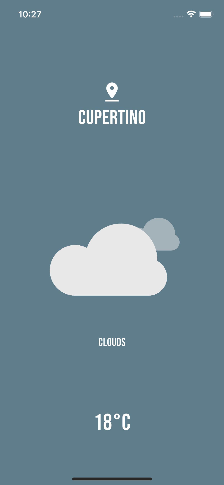

# 🌦️ Flutter Weather App

A simple Flutter application that fetches and displays the current weather based on the user's geolocation, with animated weather icons and pull-to-refresh functionality.
<p align="center">
  
</p>

---

## 🚀 Features

- 🌍 Detects current location using GPS
- 📍 Reverse geocoding to get city name
- ☁️ Fetches real-time weather data using a weather API
- 🎞️ Lottie animations for different weather conditions
- 🔄 Pull-to-refresh support (Cupertino-style)
- 🧪 Built using Flutter with clean, modular code

---

## 🧰 Tech Stack

- Flutter
- Dart
- [Geolocator](https://pub.dev/packages/geolocator)
- [Geocoding](https://pub.dev/packages/geocoding)
- [Lottie](https://pub.dev/packages/lottie)
- [flutter_dotenv](https://pub.dev/packages/flutter_dotenv)
- OpenWeatherMap (or any weather API)

---

## 📦 Getting Started

### 1. Clone the repository

```bash
git clone https://github.com/your-username/flutter-weather-app.git
cd flutter-weather-app
```

### 2. Install dependencies
```bash
flutter pub get
```

### 3. Set up .env
Create a .env file in the root directory and add your weather API key:
```bash
WEATHER_API_KEY=your_api_key_here
```
You can get a free API key from OpenWeatherMap.

### 4. Run the app
```bash
flutter run
```

## 📂 Project Structure
```bash
lib/
├── models/
│   └── weather_model.dart          # Weather data structure
├── services/
│   └── weather_service.dart        # Handles API and geolocation logic
├── pages/
│   └── weather_page.dart           # Main UI and logic
├── main.dart                       # Entry point
```

## 🧪 How It Works
	•	When the app starts, it:
	1.	Fetches the user’s current GPS coordinates.
	2.	Uses reverse geocoding to determine the city.
	3.	Calls a weather API with latitude & longitude to get weather data.
	4.	Displays the weather using Lottie animations based on the condition.
	•	Users can pull down to refresh the weather data.

 
